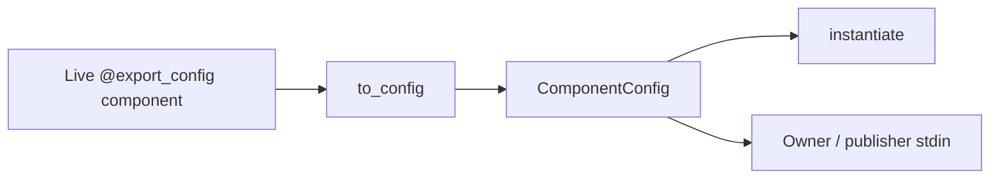

# Component config — reviewer brief

**Read time:** ~3–5 minutes  
**Status:** Accepted design — gathering implementation opinions  
**Full map:** [component-config-report.md](component-config-report.md)  
**Canonical spec:** [component-config.md](component-config.md)  
**Context:** Follow-up to [Studio SharedRobot #818](https://github.com/open-edge-platform/physical-ai-studio/pull/818)

---

## Problem

jsonargparse can build a component tree from YAML, but nothing recovers constructor
args from a **live** plugin/Studio object. SharedRobot/SharedCamera need that recipe
to spawn an owner/publisher child. Today Studio either special-cases serializers or
cannot share third-party drivers cleanly.

## Proposal

```text
@export_config  →  remember supplied __init__ args
to_config(live) →  {class_path, init_args}   # ComponentConfig
instantiate(cfg)→  fresh disconnected instance
```

Same shape as existing jsonargparse configs. Protocols (`Robot`, `Camera`, …) stay
behavior-only. Transport settings (`name`, `service_name`, rates) stay in envelopes.



## Decisions we want opinions on

| Decision                                   | Locked choice                                                   | Why                                                            |
| ------------------------------------------ | --------------------------------------------------------------- | -------------------------------------------------------------- |
| Opt-in decorator vs `to_dict` on protocols | `@export_config` in `physicalai.config`                         | Keeps runtime protocols clean; plugins stay transport-agnostic |
| Export ≠ share                             | Studio decides whether to wrap; Runtime only exports the recipe | Decorating for CLI must not force SharedRobot                  |
| Paths                                      | Relative as given; child inherits parent cwd                    | Fits “export a folder”; no absolutizer API                     |
| Inference factory                          | **Out of v1, keep inference as is**                             | `ComponentSpec` differs (defaults, extras, registry)           |

## What v1 covers (sketch)

- Robots (SO101, WidowX, bimanual as one owner), cameras, PolicySource graph,
  path-rooted `InferenceModel`, RobotRuntime + listed callbacks
- SharedCamera: built-in `service_name` derived in transport; third-party must
  pass an explicit name
- Trust: `instantiate` only on local / parent→child config — never network metadata

## Out of scope (v1)

Inference `ComponentSpec` unification · portable bundles · callable
`to_action` · per-arm SharedRobot · persisted workflow document versioning

## Where to dig deeper

| Need                                        | Doc                                  |
| ------------------------------------------- | ------------------------------------ |
| Diagrams, rollout, plugin checklist         | [Report](component-config-report.md) |
| Inheritance, serialization, tests, security | [Spec](component-config.md)          |
| Security rules for `src/physicalai/`        | [security.md](security.md)           |

---
