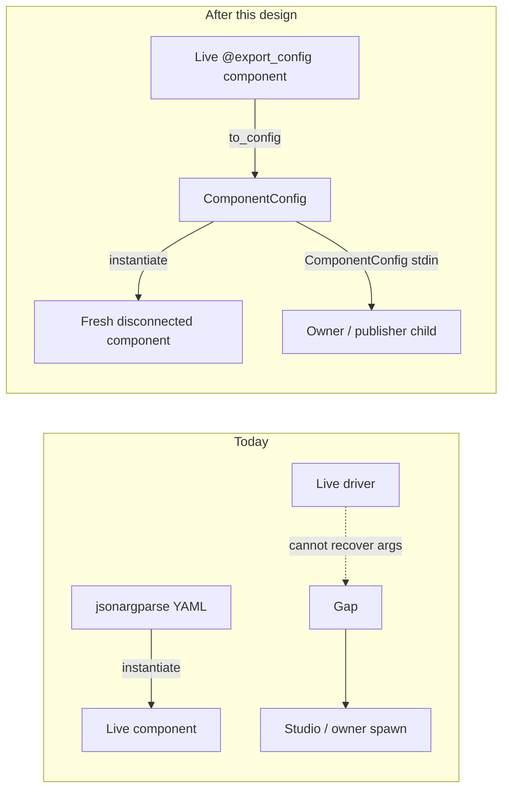
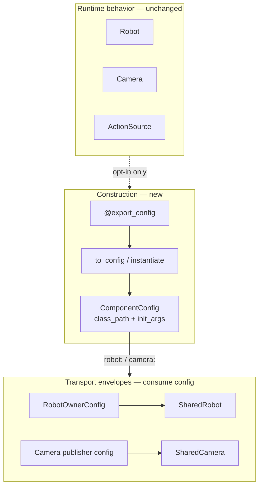
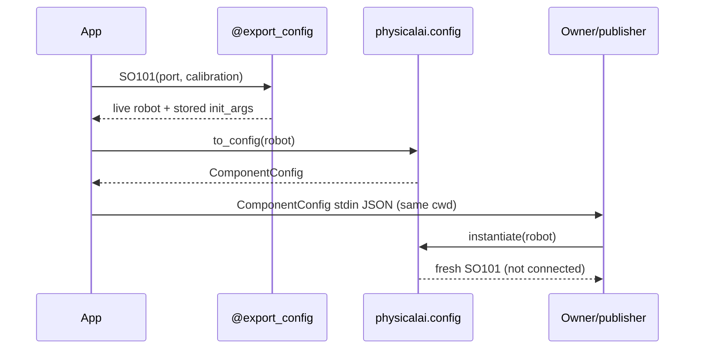
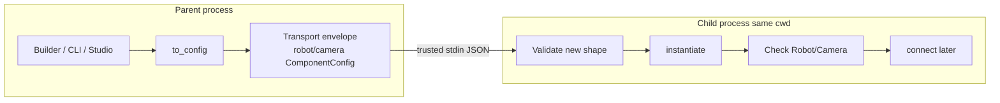
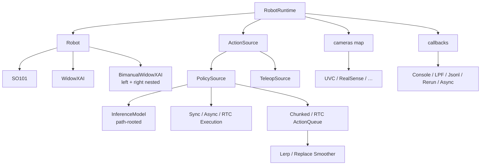
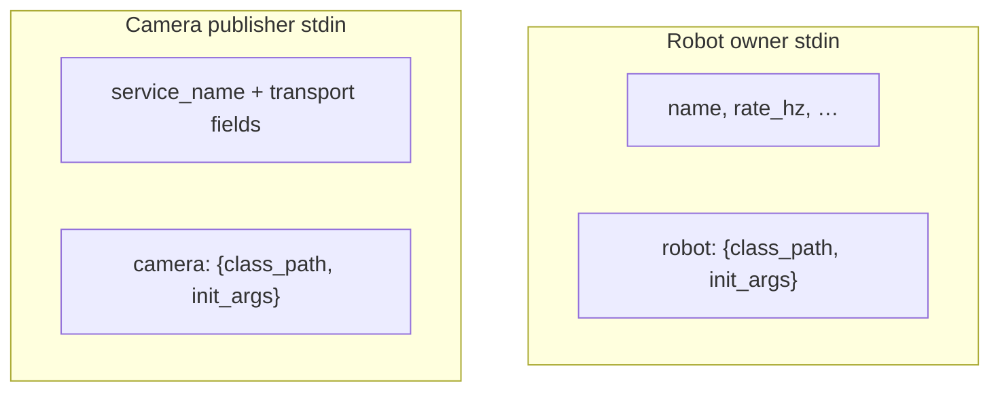
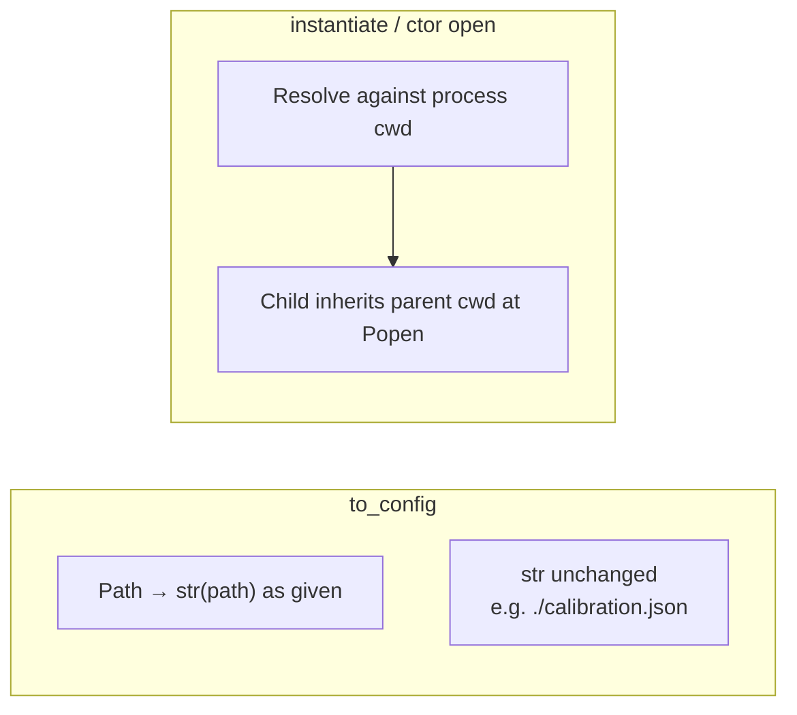
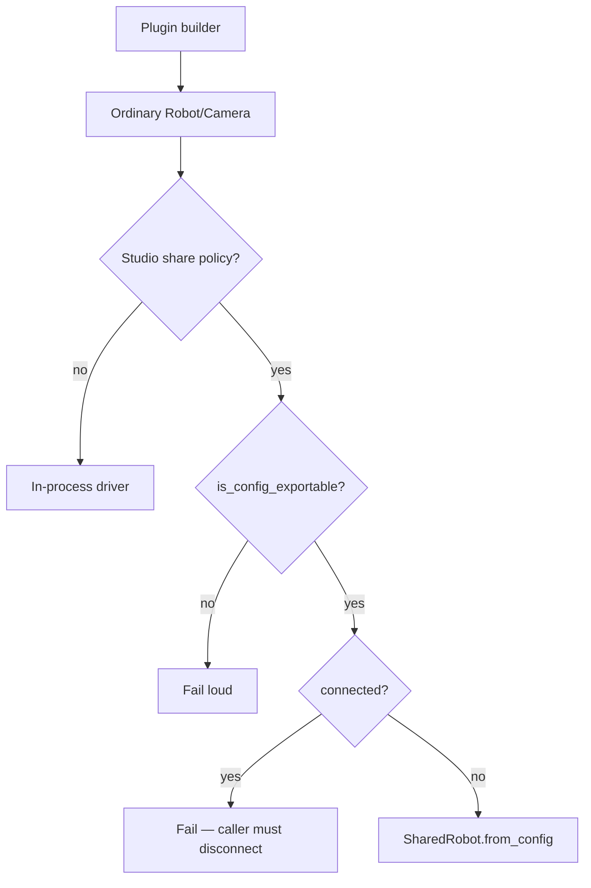

# Captured component configuration — design report

**Audience:** Runtime developers  
**Status:** Accepted — implement per rollout  
**Short brief (reviewers):** [component-config-brief.md](component-config-brief.md)  
**Canonical spec:** [component-config.md](component-config.md)  
**Context:** Follow-up to [Studio SharedRobot #818](https://github.com/open-edge-platform/physical-ai-studio/pull/818)

This report is the human-readable map of the design. Prefer the [brief](component-config-brief.md) for a quick overview. When behavior is ambiguous, the canonical design note wins.


---

## One-sentence summary

Opt-in `@export_config` keeps constructor args as JSON-safe `class_path` + `init_args`, so Studio and SharedRobot/SharedCamera can spawn fresh components **without** special-case serializers or transport imports in plugins.

---

## Why it exists



| Pain                                                            | Fix                                              |
| --------------------------------------------------------------- | ------------------------------------------------ |
| jsonargparse builds trees but cannot reverse a live object      | `@export_config` + `to_config`                   |
| SharedRobot needs class + JSON kwargs across a process boundary | Same `ComponentConfig` in the owner envelope     |
| Studio serializers per robot/camera type                        | Plugins opt in; Studio only checks exportability |
| Putting `to_dict` on `Robot` / `Camera`                         | Keep protocols behavior-only                     |

---

## Three-layer mental model



**Remember:**

- **Construction** = how to build a fresh instance
- **Transport** = name, rate, `service_name`, timeouts, sharing
- **Exportable ≠ shared** — Studio decides whether to wrap in `SharedRobot`; `@export_config` only enables config export

---

## Public API (`physicalai.config`)

```python
ComponentConfig = {"class_path": str, "init_args": dict[str, JsonValue]}

@export_config                    # opt-in on concrete classes
@export_config(class_path="...")  # when public import ≠ defining module
to_config(value)                  # live → ComponentConfig
instantiate(config)               # trusted ComponentConfig → fresh object
is_config_exportable              # @export_config marker only
# Domain args: to_config_value() → plain JSON (ConfigValue Protocol)
```



Library code always uses module-level `to_config(value)` (type-checker friendly). An injected instance method is optional sugar only.

---

## End-to-end data flow



**Trust rule:** `instantiate()` is for trusted local / parent→child config only. Never run it on Zenoh metadata, camera metadata, or peer payloads.

---

## What gets exported (v1)



| Area                     | v1 rule                                                                                   |
| ------------------------ | ----------------------------------------------------------------------------------------- |
| Defaults                 | Capture only supplied args — omit ⇒ current ctor defaults on replay                       |
| `PolicySource`           | Default queue uses **LerpSmoother**; bare `ChunkedActionQueue()` uses **ReplaceSmoother** |
| `InferenceModel`         | Path-rooted (`export_dir`, scalars); live runner/processor overrides fail `to_config`     |
| `TeleopSource.to_action` | Replayable only when omitted                                                              |
| Bimanual                 | One SharedRobot owner for the composite                                                   |
| Callbacks                | Exact first-party set; observers with post-hoc `session_id` out of scope                  |

---

## Transport migration (private wire)

Do **not** bump `ROBOT_TRANSPORT_PROTOCOL_VERSION` or camera frame `PROTOCOL_VERSION` for this. Those are network/frame protocols. Startup stdin is a same-package `Popen` handshake — **hard cutover** to `ComponentConfig` with no `config_format` and no dual-read (recorded in the [spec](component-config.md#private-startup-envelopes-hard-cutover)).

```text
# Robot owner — after
{name, robot: {class_path, init_args}, allow_remote, rate_hz, idle_timeout, …}

# Camera publisher — after
{camera: {class_path, init_args}, service_name, idle_timeout, …}
```

Writers and readers speak only the new shape. Legacy flat stdin (`robot_class` / `camera_type`) is rejected before import.



### SharedCamera naming

| Mode              | `service_name`                                                             |
| ----------------- | -------------------------------------------------------------------------- |
| Built-in spawn    | Derived in transport: `class_path` → legacy `CameraType` token + device id |
| Third-party spawn | **Required** explicit name (no hashing)                                    |
| Attach-only       | Required; no construction config                                           |

`service_name` lives **beside** `camera: ComponentConfig`, never inside `init_args`.

### Public API (adapters)

| Surface                | Accept (XOR)                                            | Preferred                     |
| ---------------------- | ------------------------------------------------------- | ----------------------------- |
| `SharedRobot`          | `robot=` **xor** `robot_class`+`robot_kwargs` (adapter) | `from_config` / `from_robot`  |
| `SharedCamera`         | `camera=` **xor** `camera_type`+kwargs (adapter)        | `from_config` / `from_camera` |
| CLI `physicalai robot` | `--robot` **xor** legacy flags (adapter)                | `--robot`                     |
| Metadata               | Keep key `robot_class`                                  | Value = public `class_path`   |

Legacy flat forms always pack `ComponentConfig` and write only the new stdin. Removing adapters is a later cleanup PR.

`from_robot` / `from_camera`: require exportable, **reject if connected**, never disconnect implicitly.

---

## Paths: relative-first, cwd at open



- Prefer relative paths for project- or folder-local configs (portable export directories).
- Do not absolutize in `to_config` or IPC writers.
- Unsupported: `chdir` between export and spawn when configs still contain relatives.
- Future bundle/export-folder root may pin resolution without absolutizing — not v1.

---

## Studio consumption



Plugins never import Zenoh, iceoryx2, `SharedRobot`, or `SharedCamera`.

---

## Security (developer checklist)

| Do                                                    | Don't                                                 |
| ----------------------------------------------------- | ----------------------------------------------------- |
| Treat `class_path` as executable trusted config       | Instantiate configs from `/metadata` or network peers |
| Validate malformed input before import                | Assume validation = sandbox                           |
| Carry config parent→child stdin only                  | Accept component configs from subscribers             |
| Keep nesting depth bounded (`_MAX_CONFIG_DEPTH = 10`) | Unbounded recursive instantiate                       |

See also [security.md](security.md) rules 4, 5, 11, 12.

---

## Out of scope for v1

- Inference `ComponentSpec` / `instantiate_component` unification (different defaults, extras, registry)
- Self-contained portable bundles / `to_config(..., profile="self_contained")` / explicit bundle root
- `__component_path_keys__` / public path absolutizers
- Callable references for `TeleopSource.to_action`
- Per-arm SharedRobot for bimanual nests
- Persisted workflow document versioning

---

## Implementation rollout

```mermaid
gantt
  title Suggested implementation order
  dateFormat X
  axisFormat %s

  section Core
  physicalai.config engine           :a1, 0, 1
  export_config + to_config          :a2, 1, 2
  SO101 / WidowX / Bimanual          :a3, 2, 3

  section Transport
  SharedRobot + owner hard cutover   :b1, 3, 4
  SharedCamera + publisher cutover   :b2, 4, 5

  section Runtime tree
  PolicySource graph + InferenceModel :c1, 5, 6
  RobotRuntime + callbacks            :c2, 6, 7

  section Downstream
  Studio share policy                 :d1, 7, 8
  Docs / preview versioning note      :d2, 8, 9
```



| Step | Deliverable                                                                                  |
| ---: | -------------------------------------------------------------------------------------------- |
|    1 | `ComponentConfig`, instantiate, depth/cycles, shared importer (no inference behavior change) |
|    2 | `@export_config`, `to_config`, `is_config_exportable`                                        |
|    3 | SO101, WidowXAI, BimanualWidowXAI round-trips                                                |
|    4 | SharedRobot + owner stdin hard cutover + public/CLI adapters (cwd inherit for relatives)     |
|    5 | SharedCamera + publisher stdin hard cutover + `service_name` rules                           |
|    6 | PolicySource graph, TeleopSource, path-rooted InferenceModel, v1 callbacks                   |
|    7 | RobotRuntime -> `instantiate` + jsonargparse                                                 |
|    8 | Studio drops interim serializers                                                             |
|    9 | User-facing docs                                                                             |
|   10 | Separate: inference factory follow-up (optional)                                             |

Implement **one step at a time**. Keep the design note open as the contract.

---

## Plugin checklist

1. Implement `Robot` / `Camera` / `ActionSource` / callback protocol
2. `@export_config` — use `@export_config(class_path="…")` when re-exported
3. JSON-normalizable args (JSON / nested `@export_config` / `to_config_value()`);
   constructors accept normalized forms
4. Relative path args OK; keep cwd stable through Shared\* spawn (or use absolute/`Path` as given)
5. Stable public import path (decorator `class_path=` when it differs from defining module)
6. Round-trip test: `to_config` → `json` → `instantiate` → `to_config` equal

## Studio: `is_config_exportable` + `to_config` only

## Quick reference

| Symbol                         | Role                                                                |
| ------------------------------ | ------------------------------------------------------------------- |
| `@export_config`               | Opt into `ComponentConfig` export (stores supplied `__init__` args) |
| `@export_config(class_path=…)` | Public re-export path when ≠ defining module                        |
| `to_config_value()`            | Domain arg → plain JSON inside `init_args` (`ConfigValue`)          |
| `ComponentConfig`              | Wire shape shared with jsonargparse                                 |
| `to_config` / `instantiate`    | Export / trusted rebuild                                            |
| `is_config_exportable`         | Can we get a recipe? (decorator marker)                             |
| Owner/publisher stdin          | Hard cutover to `robot:` / `camera: ComponentConfig`                |
| `service_name`                 | Camera transport identity (not construction)                        |

**Full rules and required tests:** [component-config.md](component-config.md)
