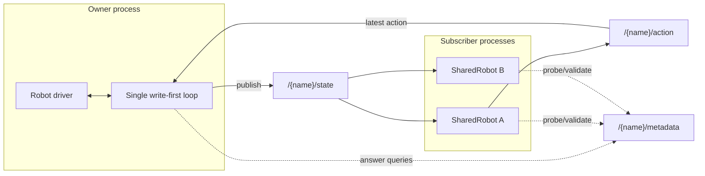
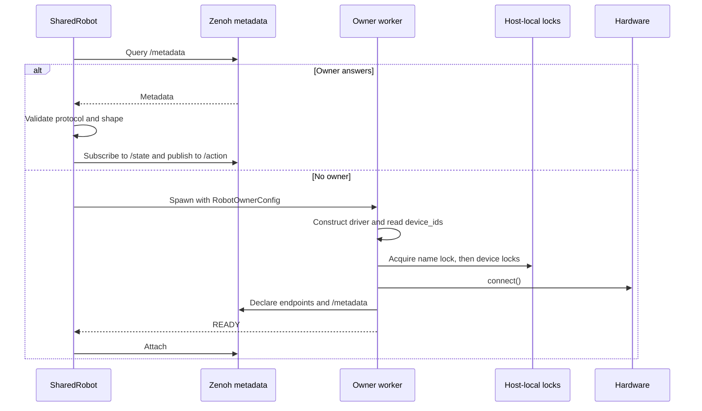

# Design: Zenoh Transport for Shared Robots

**Status:** Implemented

`physicalai.robot.transport` lets one process own a robot's hardware connection while
multiple processes read state and send actions over
[Zenoh](https://zenoh.io/). This is the canonical design for that transport.

The design follows `SharedCamera`'s probe, spawn-or-attach structure, but uses Zenoh
instead of same-host shared memory. Robot state and action payloads are small and may
cross hosts; camera frames remain in `SharedCamera`.

## Architecture

One detached **owner** process constructs and connects the real robot driver. It runs
a single write-first control loop. Each **subscriber** is a `SharedRobot` that pulls
the latest state and publishes absolute joint targets.



The full key prefix is `physicalai/robot`. Each robot has three keys:

| Key                                | Pattern   | Semantics                                          |
| ---------------------------------- | --------- | -------------------------------------------------- |
| `physicalai/robot/{name}/state`    | pub-sub   | Owner to subscribers; continuous, latest-wins      |
| `physicalai/robot/{name}/action`   | pub-sub   | Subscribers to owner; fire-and-forget, latest-wins |
| `physicalai/robot/{name}/metadata` | queryable | Discovery, compatibility, and liveness             |

`SharedRobot` satisfies the `Robot` protocol. Camera frames are deliberately excluded;
`SharedRobot.get_observation().images` is always `None`.

## Public API and identity

Normal construction means "create this named service if absent, then attach":

```python
robot = SharedRobot(
    name="left-arm",
    robot_class=SO101,
    robot_kwargs={
        "port": "/dev/ttyACM0",
        "calibration": "calibration.json",
    },
)
```

Attach-only construction is explicit:

```python
robot = SharedRobot.attach("left-arm")
```

Two identities serve different purposes:

- `name` is the logical service identity used in Zenoh keys. It is required and must
  be one non-empty segment containing only ASCII letters, digits, `_`, or `-`.
- `Robot.device_ids` identifies every physical resource a driver owns exclusively.
  It is available before `connect()`, stable across equivalent construction, and used
  only for host-local locking. `SharedRobot.device_ids` is empty because a subscriber
  owns no hardware.

Keeping these identities separate avoids guessing physical ownership from constructor
kwargs such as `port` or `ip`, and supports arbitrary and composite robots.

### Arbitrary robot construction

`robot_class` may be an importable class or dotted path. Class objects normalize to
`cls.__module__ + "." + cls.__qualname__`; explicit strings are preserved. The owner
subprocess imports the class and calls it with `robot_kwargs`.

The private `RobotOwnerConfig` carries the normalized path and JSON-serializable
kwargs across the subprocess boundary. Local classes, lambdas, live instances, and
non-serializable kwargs cannot be auto-spawned. Class paths and kwargs are trusted
local application input. A class path received over Zenoh is never imported.

If an owner already exists, the name is authoritative and the construction recipe is
unused. A caller-supplied class path that differs from metadata produces a warning,
not an error: re-exports, wrappers, and subclasses may preserve the wire contract.

## Create-or-attach and ownership

`SharedRobot.connect()` first probes the named `/metadata` key. It attaches when a
compatible owner answers; otherwise create-or-attach instances spawn an owner and
attach-only instances fail.



The worker startup order is an invariant:

```text
construct driver -> read device_ids -> acquire name lock
-> acquire sorted device locks -> connect -> declare endpoints -> READY
```

Construction may validate files or configuration but must not access hardware.
Hardware access starts only after every lock is held.

### Host-local locking

POSIX `flock` files in a private runtime directory provide crash-safe arbitration.
Linux uses `$XDG_RUNTIME_DIR/physicalai/robot-locks`; other Unix hosts fall back to
a per-user directory below the platform temporary directory. Lock state is kept out
of cache and durable application-storage directories:

- one `name:{name}` lock serializes concurrent creation of the same service;
- one `device:{device_id}` lock protects each physical resource;
- lock filenames are SHA-256 hashes of the namespace and identity;
- diagnostic contents record lock kind, raw identity, owner name, and PID;
- device IDs are sorted and deduplicated before acquisition;
- partial acquisitions are released in reverse order; and
- lock files may remain after release because the open descriptor, not file
  existence, represents ownership.

The name lock is necessary because query-then-declare is not atomic and Zenoh permits
multiple entities on one key. A TCP bind failure is not the ownership arbiter.

An empty `device_ids` tuple is valid only for a virtual robot with no exclusive
physical resource. Composite robots report all constituent resources.

If two processes concurrently create the same name, the loser re-probes metadata. It
attaches if its resolved device IDs match the winner and raises `RobotNameConflict` if
they differ. A device already locked under another name raises
`RobotDeviceAlreadyOwned` before hardware connection.

`flock` guarantees exclusivity only within one host. Deployments must designate one
owner host per network robot using topology, firewall policy, or operator
configuration. Distributed leases and hardware fencing are deferred.

### Local discovery registry

Local-only sessions cannot use multicast or gossip. Name-lock diagnostic files
therefore also provide candidate names for host-local discovery. Discovery filters
entries by live owner PID, then confirms each candidate through its deterministic
loopback `/metadata` queryable. Stale files are harmless.

## Transport scope and rendezvous

Local-only operation is the secure default:

| `allow_remote` | Reachability          | Security contract                                       |
| -------------- | --------------------- | ------------------------------------------------------- |
| `False`        | Same-host processes   | No Zenoh transport exposed to the LAN                   |
| `True`         | Reachable Zenoh peers | Trusted robot-cell network; deployer provides isolation |

All sessions use peer mode. With `allow_remote=False`, multicast and gossip scouting
are disabled, the owner listens only on loopback, and subscribers connect only to the
same deterministic loopback endpoint. With `allow_remote=True`, the owner listens on
all interfaces and scouting is enabled.

The owner and subscribers hash the full robot prefix into an unprivileged port in
`20000-59999`. A bind collision is a structured startup error that reports the exact
derived endpoint and tells the operator to choose another name or configure a local
Zenoh router. The owner does not probe alternate ports because independent subscribers
must derive the same endpoint.

The caller that spawns an owner fixes its scope for the owner's lifetime. A later
attacher controls only its own session and cannot widen or narrow the running owner.
Remote attachment requires explicit `allow_remote=True`.

Long-running remote clients can retain one scouting session through
`SharedRobotClient(allow_remote=True)`. The client is attach-only and owns
the session for its context lifetime: its first discovery includes Zenoh
route establishment, and later discovery or attachments reuse that warmed
session. `SharedRobotClient()` also supports same-host reuse with local-only
scope. With no explicit timeout, the first discovery gets a one-second budget
and later discovery gets 0.1 seconds. It disconnects all robots attached
through the client before closing the session. The wildcard discovery timeout
remains a collection window even for a warmed session because Zenoh cannot
signal that every reachable owner has replied.

## Owner loop and subscriber behavior

The owner is the only thread that touches the driver. Each tick is:

1. Pull the newest `/action` sample without blocking and apply it if present.
2. Read the measured observation.
3. Publish `/state`.
4. Update subscriber-presence and idle-shutdown state.
5. Sleep until the next fixed-rate tick without accumulating scheduling debt.

Write-first ordering minimizes action latency. With no new action, the owner sends
nothing and the servos hold their last target. Malformed or rejected actions are
logged and do not kill the shared owner. Five consecutive observation failures stop
the owner.

The default rate is 100 Hz. A slower blocking driver naturally runs below that rate;
callers may provide a positive finite `rate_hz` when measurements justify an override.

The `/state` subscriber uses native `RingChannel(1)` buffering and non-blocking
`try_recv()`. The ring remains active independently of Python callback scheduling,
keeps only the newest state, and avoids stale backlogs. `get_observation()` returns a
cached last-known state when no newer sample is waiting. The payload timestamp exposes
staleness.

Actions are absolute joint targets, so dropping intermediate actions is safe. This
latest-wins design would not be valid for relative or delta actions.

A subscriber's `disconnect()` closes only its own Zenoh session. The owner detects
zero state subscribers through publisher matching status, waits `idle_timeout`, calls
the underlying driver's `disconnect()` to satisfy the safe-state contract, and exits.
Startup failures after hardware connection also disconnect the driver before releasing
locks.

## Wire protocol

Zenoh carries opaque bytes. State, action, and metadata use msgpack dictionaries;
NumPy arrays use `{dtype, shape, data}` records so dtype and shape round-trip exactly.
Images never enter this protocol.

`/state` contains:

```python
{
    "joint_positions": encode_numpy(obs.joint_positions),
    "state": encode_numpy(obs.state),
    "timestamp": obs.timestamp,
    "sensor_data": {key: encode_numpy(value), ...} | None,
}
```

The owner ships its computed `obs.state`, not merely joint positions. This is required
because robot state is implementation-specific: SO101 uses joint positions, while
WidowXAI variants concatenate positions and velocities. Recomputing state in the
subscriber would duplicate driver logic and can silently change model input shape.

`/action` contains the absolute action array, `goal_time`, and a monotonic send
timestamp.

`/metadata` contains only public transport information:

```python
{
    "protocol_version": 1,
    "name": "left-arm",
    "robot_class": "physicalai.robot.SO101",
    "device_ids": ["serial:/dev/serial/by-id/usb-FTDI_1234"],
    "host": "robot-cell-01",
    "joint_names": [...],
    "num_joints": 6,
    "state_dim": 6,
}
```

Metadata excludes constructor kwargs, calibration paths or contents, credentials,
tokens, and arbitrary configuration. `device_ids` may expose serial numbers, paths,
or IP addresses; this is an intentional diagnostic choice within the transport's
trust boundary.

`ROBOT_TRANSPORT_PROTOCOL_VERSION` versions the wire contract, not robot classes or
package releases. It changes for backward-incompatible payload, required-field, or
semantic changes, but not for additive optional fields or internal refactors.
Subscribers reject unsupported versions before declaring the action publisher.
Metadata validation also requires non-empty unique joint names,
`num_joints == len(joint_names)`, and positive `state_dim`.

## QoS

State and action publishers pin Zenoh's low-latency semantics explicitly:

- `Reliability.BEST_EFFORT`: loss is acceptable under latest-wins semantics;
- `CongestionControl.DROP`: a full queue never blocks the control loop; and
- `express=True`: bypasses batching for small, high-rate messages.

Functional tests do not detect batching regressions, so p99 action-latency jitter
should be measured at the target loop rate when changing Zenoh configuration.

## Errors and startup handshake

The parent sends JSON configuration over stdin. The worker emits exactly one `READY`
or `ERROR:{json}` line on stdout. Structured phases distinguish construction,
connection, lock contention, endpoint collision, timeout, and unexpected startup
failure without parsing human-readable messages.

The public hierarchy stays limited to conditions with different caller recovery:

```text
RobotError
├── RobotNotConnectedError
└── RobotTransportError
    ├── RobotNameConflict
    ├── RobotDeviceAlreadyOwned
    └── RobotProtocolMismatch
```

Other import, construction, connection, handshake, codec, timeout, and endpoint
failures remain `RobotTransportError` with structured phase details.

## Security boundary

In remote mode, any peer that can reach `/action` can move the physical robot. The
transport provides no application-level authentication or authorization. It must run
on a trusted robot-cell network isolated by VLAN/firewall policy or Zenoh ACL/TLS.

Local-only mode avoids that exposure by disabling discovery and binding only to
loopback. Msgpack is used instead of `pickle`, so malformed transport payloads do not
introduce arbitrary code execution. Owner-advertised class paths are diagnostic strings
and are never imported.

## Deferred work

The following can be added without breaking the current protocol when a concrete need
appears:

- action acknowledgement or blocking safety-command channels;
- router-enforced write authorization;
- distributed ownership leases with hardware fencing.
