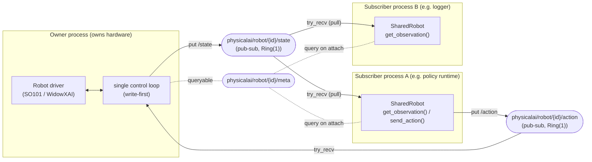
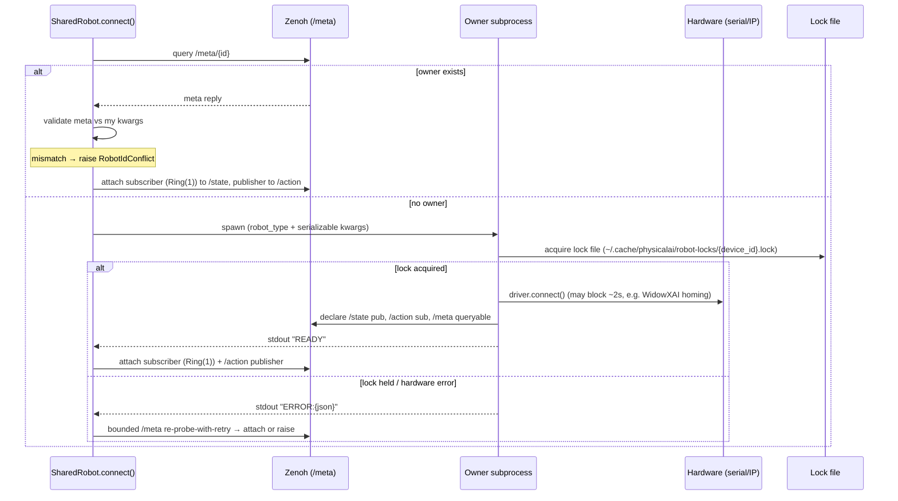
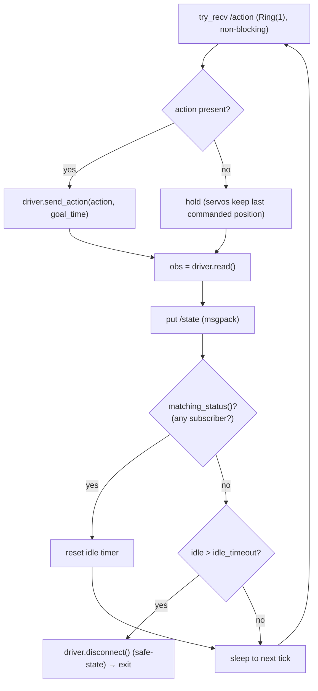

# Design: Zenoh Transport Layer for Shared Robots

**Status:** Implemented
**Scope:** `physicalai.robot.transport` — a multi-process transport that lets one
process own a robot's exclusive hardware connection while any number of other
processes read its state and issue actions over [Zenoh](https://zenoh.io/).

This mirrors the _structure_ of the existing `SharedCamera`
(`physicalai.capture.transport`) — probe → spawn-or-attach → pub/sub — but uses a
different transport (Zenoh, network-capable) instead of iceoryx2 (same-host shared
memory), because robot state/action payloads are tiny and may cross hosts, whereas
camera frames are large and same-host.

---

## 1. Architectural overview

One **owner** process holds the real hardware connection (serial for SO-101, TCP/IP
for Trossen). It runs a single control loop that publishes robot **state** and
consumes **actions**. Any number of **subscriber** processes attach over Zenoh: they
pull the latest state on demand and publish actions fire-and-forget. The first
`Robot` instance that finds no existing owner spawns one; later instances attach.



`SharedRobot` structurally satisfies the existing `Robot` protocol
(`connect`/`disconnect`/`get_observation`/`send_action`/`is_connected`/`joint_names`),
so it is a drop-in replacement — no protocol changes required.

### Key properties

- **Owner is single-threaded** with respect to hardware — no background threads touch
  the driver, so there is no serial-bus contention and no lock to manage.
- **Subscribers never use a background callback thread** — reads are pull-on-demand,
  which is GIL-independent and matches the protocol's pull model.
- **Tiny payloads only** — joint vectors, not frames. Camera frames stay in
  `SharedCamera`.

---

## 2. Key layout

Three Zenoh keys per robot, all under a derived `robot_id`:

| Key                            | Pattern   | Direction               | Semantics                         |
| ------------------------------ | --------- | ----------------------- | --------------------------------- |
| `physicalai/robot/{id}/state`  | pub-sub   | owner → subscribers     | continuous, latest-wins           |
| `physicalai/robot/{id}/action` | pub-sub   | subscribers → owner     | fire-and-forget, latest-wins      |
| `physicalai/robot/{id}/meta`   | queryable | owner answers on demand | discovery + validation + liveness |

Discovery: a wildcard query on `physicalai/robot/*/meta` enumerates all reachable
robots. No reply ⇒ no owner, which doubles as the liveness check.

---

## 3. Lifecycle: spawn-or-attach

`SharedRobot.connect()` probes for an existing owner via `/meta`. If none, it spawns
an owner subprocess; if it loses the spawn race, it falls back to attaching.



**Why spawn passes `robot_type + kwargs`, not a `Robot` object:** the driver owns a
live serial/socket handle that cannot be pickled or shared across a process boundary.
The subprocess must _construct_ the robot itself. Consequently **all spawn kwargs must
be serializable** — e.g. SO-101 `calibration` must be passed as a **file path**, not a
live `SO101Calibration` object; `role` as a string.

**Ready/error handshake.** The spawning caller must distinguish "still connecting" from
"lost the race" from "real hardware failure" (e.g. permission denied on
`/dev/ttyUSB0`). This is not theoretical: `WidowXAI.connect()` blocks for ~2 s doing a
homing move (`driver.set_all_positions(HOME_POSITION, 2.0, True)`), so a blind
short-timeout poll would misfire on that robot. Reuse the proven mechanism
`CameraPublisher.start()` already implements: the owner writes a single `READY` or
`ERROR:{json}` line to stdout, the parent blocks on it with a generous timeout, and on
failure falls back to the same bounded `/meta` re-probe-with-retry that
`SharedCamera.connect()` uses. No new protocol.

**A self-managed lock file is the single-owner arbiter (both backends).** The Zenoh
`/meta` probe has a check-then-act (TOCTOU) gap: two cold-starting processes can both
see "no owner" and both try to grab the same hardware. The arbiter is a self-managed
lock file at a deterministic, **user-scoped** path derived from the same `device_id`
used in `robot_id` — e.g. `~/.cache/physicalai/robot-locks/{device_id}.lock` — held for
the owner's lifetime. This is transport-agnostic and works identically for serial and
IP, avoiding reliance on Trossen "connection refusal" (unverified vendor behavior: many
embedded controllers accept multiple concurrent TCP clients). The user-scoped cache
directory (not a world-writable `/tmp` path) avoids the symlink/predictable-path race
of CWE-377. Whoever wins the lock is the owner; the loser re-probes `/meta` and
attaches.

---

## 4. Owner control loop

Single thread, **write-first** ordering:



**Why write-first:** the read captures _measured current position_ regardless of
order, so state freshness is a wash between orderings. Applying the newest action at
the top of the tick minimizes action latency (it doesn't wait behind read+publish),
and the state published afterward reflects the post-command read.

**Loop rate:** a **fixed, high** target rate (a few× the policy's action rate — e.g.
100–200 Hz for a 30 Hz policy), _not_ unbounded. The serial read is blocking and
releases the GIL, so the loop is I/O-bound, but a fixed rate keeps action latency
bounded (≤ one owner period), deterministic, and avoids needlessly saturating the bus.
The rate is **per-robot configurable** (a spawn parameter) with a robot-appropriate
default — SO-101 (serial bus) and WidowXAI (TCP) have different realistic ceilings, so
one global constant is wrong.

**No-action = hold.** When `try_recv()` returns `None`, the owner sends nothing and the
servos hold their last commanded position. Freezing is safer than silent motion. No
deadman timer (deferred — see §13).

**Idle shutdown honors the safe-state contract.** When the owner exits on idle timeout
it first calls the underlying **`driver.disconnect()`** (which homes/stops and cleans
up the SDK connection), so the `Robot` protocol's "leave the robot in a safe, stationary
state" guarantee holds on the owner side too — not only for direct driver users.

---

## 5. Subscriber read/write paths

### Read (pull-on-demand)

The subscriber declares `/state` with a **native `RingChannel(1)`** handler and pulls
with the **non-blocking `try_recv()`** inside `get_observation()`:

```python
def get_observation(self) -> RobotObservation:
    sample = self._state_sub.try_recv()   # newest-or-None, non-blocking
    if sample is not None:
        self._latest = decode_state(sample)
    return self._latest                    # cached last-known if nothing new
```

- **GIL-independent buffering (verified):** `RingChannel` is a native (Rust) handler.
  Zenoh's runtime deposits samples into the ring without the Python GIL, so buffering
  continues even while the subscriber's main thread holds the GIL in a long C call
  (e.g. inference). Only the `try_recv()` _retrieval_ needs the GIL — which the
  subscriber was holding anyway.
- **Latest-wins, no backlog:** Ring(1) evicts all but the newest, so a stalled
  subscriber resumes on the current state, never a burst of stale samples.
- **Staleness is visible:** `timestamp` in the payload quantifies age.
- **Cold start:** the ring is empty until the first publish after attach. With a
  continuously-publishing owner this fills within one period. (On-change publishing
  would need a `session.get()` / publication cache — not planned.)

### Write (fire-and-forget)

`send_action()` calls `pub.put()` on the subscriber's own main thread — a call it
makes, not a callback it waits on. No thread, no GIL starvation. Latest-wins on the
owner's Ring(1) is safe because **actions are absolute joint targets** (dropping an
intermediate target just skips to the newest). This invariant would break for
relative/delta actions.

### `disconnect()` semantics

A subscriber's `disconnect()` **only closes its own Zenoh session** — it must **not**
signal the owner to stop motors. The owner owns safe-state. Detection of a departed
subscriber is handled by Zenoh liveness (`matching_status`), so it works identically
whether the subscriber exits cleanly or crashes.

---

## 6. Wire format

Zenoh moves **opaque bytes**; the codec is ours. We use **msgpack** (a dict-based,
self-describing, forward-compatible record), with `numpy` arrays encoded as a nested
`{dtype, shape, data}` record to preserve exact dtype and shape.

```python
def encode_numpy(arr):
    return {"__np__": True, "dtype": str(arr.dtype), "shape": list(arr.shape),
            "data": arr.tobytes()}

def decode_numpy(obj):
    return np.frombuffer(obj["data"], dtype=np.dtype(obj["dtype"])).reshape(obj["shape"])
```

**Why msgpack over `zenoh.ext` serialization:** `zenoh.ext.z_deserialize(tp, ...)`
requires the exact target type and only supports _homogeneous_ dicts (`dict[K, V]`);
a heterogeneous record (`bytes` + `str` + `list` + `float`) must become a positional
`Tuple`, which is brittle to evolution (adding a field changes the signature on both
sides). msgpack handles heterogeneous, evolvable dicts natively. Serialization cost is
negligible for tiny joint vectors, so performance is not a factor.

**Why not `str(array)` / JSON list:** `str(np.ndarray)` truncates large arrays with
`...`, loses dtype, and loses float precision; a JSON list upcasts `float32` →
`float64`. `tobytes` + carried `dtype` round-trips exactly.

### Payload schemas

**`/state`** (`joint_positions` and `state` both shipped — see §7):

```python
{
  "joint_positions": encode_numpy(obs.joint_positions),
  "state":           encode_numpy(obs.state),          # owner-computed, robot-specific
  "timestamp":       obs.timestamp,                    # time.monotonic()
  "sensor_data":     {k: encode_numpy(v) ...} | None,  # e.g. velocities, efforts
  # images intentionally excluded — see §8
}
```

**`/action`**:

```python
{
  "action":    encode_numpy(action),   # absolute joint targets
  "goal_time": 0.1,
  "ts":        time.monotonic(),        # send time (staleness/debug)
}
```

**`/meta`** (informational + validation; no private construction secrets beyond the
identity needed to validate an attach):

```python
{
  "robot_type":  "so101",
  "joint_names": [...],
  "host":        "<hostname>",
  "connection":  "ttyUSB0" | "192.168.1.2",  # for id-conflict validation
  "state_dim":   14,
  "num_joints":  7,
}
```

Promote `encode_numpy`/`decode_numpy` (currently duplicated in
`physicalai/runtime/_telemetry.py`) into a shared util used by both telemetry and
robot transport.

---

## 7. Observation reconstruction (the state-vector contract)

The runtime feeds **`robot_obs.state`** — not `joint_positions` — to the model
(`physicalai/runtime/runtime.py`: `model_input = {STATE: np.array([robot_obs.state], ...)}`).
`.state` is **robot-specific**:

| Robot               | `.state`                                   |
| ------------------- | ------------------------------------------ |
| SO-101              | `joint_positions` (6)                      |
| WidowXAI / Bimanual | `concat(joint_positions, velocities)` (14) |

If a subscriber returned `.state = joint_positions`, WidowXAI inference would receive
**7 values instead of 14** — a silent, wrong model input.

**Resolution:** the owner already computes `.state`; it **ships the computed vector**
on `/state`. The subscriber's observation returns the shipped `state` as-is, so the
robot-specific concat logic lives only on the owner and is never re-implemented on the
subscriber. `joint_positions` and `sensor_data` are also shipped for consumers that
need them (teleoperation passes `joint_positions` straight to `send_action`). The few
floats of redundancy buy correctness and simplicity.

---

## 8. Images: excluded from robot transport

`RobotObservation` allows `images: dict[str, Frame]`, but **both** current robots hard-set
`images = None` (no built-in cameras). Shipping frames over Zenoh would:

- explode the payload (~0.9 MB/frame → ~100–180 MB/s at 100–200 Hz), destroying the
  tiny-payload property that justifies Ring(1) / high-rate / fire-and-forget;
- make per-tick encoding dominate the loop budget;
- duplicate — worse — the zero-copy shared-memory transport `SharedCamera` already
  provides for frames.

**Decision:** robot transport carries joints + `sensor_data` + timestamp only.
`SharedRobot.get_observation().images` is `None`. Any future robot with built-in
cameras surfaces those frames through the capture transport, not `/state`. This is not
an interface change in practice, since no robot populates `images` today.

---

## 9. `robot_id` derivation

The id keys the Zenoh topics and serves two distinct jobs:

| Job                            | Requirement                              | Relied on by                                   |
| ------------------------------ | ---------------------------------------- | ---------------------------------------------- |
| Same-machine spawn-or-attach   | **deterministic from connection params** | 2nd `Robot` on the same host                   |
| Network uniqueness + discovery | **unique** (readability optional)        | remote subscribers (they discover via `/meta`) |

A connection-derived id is **required** as the default, because it is the only thing
that makes a second same-machine instance re-derive the same key and _attach_ instead
of spawning a competing owner on the same port. A random name cannot do this.

**Default:**

```text
physicalai/robot/{robot_type}/{host}/{device_id}
    device_id = symlink-resolved serial basename (SO-101)  |  robot IP (Trossen)
    host      = hostname (readable; override with machine-id if guaranteed uniqueness needed)
```

Serial device ids are symlink-resolved (`Path(...).resolve().name`) so that
`/dev/ttyUSB0` and `/dev/serial/by-id/...` map to the same id. **Role is excluded** —
it keys on the physical connection, not leader/follower.

**Override:** an explicit `robot_id="left_arm"` is allowed for network-only,
manually-launched-owner setups where a logical name is nicer and same-machine attach is
not a concern. Mirrors `SharedCamera`'s overridable `service_name`.

### Conflict handling

| Scenario                           | Outcome                                                           |
| ---------------------------------- | ----------------------------------------------------------------- |
| Same id, same kwargs               | Attaches (intended).                                              |
| Same id, **different** hardware    | Caught by `/meta` validation on attach → raise `RobotIdConflict`. |
| Simultaneous cold start, same port | Lock file decides the owner; the loser attaches.                  |

On attach, the newcomer compares the owner's advertised `/meta`
(`robot_type`, `connection`) against its own construction kwargs; a mismatch means the
id was reused for a different robot, so it fails loudly instead of silently binding to
the wrong hardware. `RobotIdConflict` lives in a new `physicalai/robot/errors.py` with a
`RobotError(RuntimeError)` base, mirroring the `CaptureError(RuntimeError)` hierarchy in
`capture/errors.py` (the robot package has no error hierarchy today).

---

## 10. Session and QoS

Zenoh's defaults optimize **throughput, not latency**, and its reliability/batching
behavior must be pinned explicitly — the semantics we want (fire-and-forget,
latest-wins, drop-is-fine, low-latency) do not match the throughput-tuned defaults.

- **Publishers (`/state`, `/action`)** declared with:
  - `reliability=Reliability.BEST_EFFORT` — messages may be lost; matches D7/D8
    (drop-is-fine). Reliable-and-drop can silently degrade to best-effort with **no
    app-level drop signal**, so choosing explicitly is better than the default.
  - `congestion_control=CongestionControl.DROP` — never block the owner loop on a full
    queue. (`DROP` is already the enum default; stated explicitly so it can't regress.)
  - `express=True` — bypass Zenoh's latency **batching**. Small messages at 100–200 Hz
    sit exactly in the batching danger zone (`rmw_zenoh` observed 400–1700 µs late
    delivery at similar small-message rates until batching was disabled). `express`
    sends each sample immediately.
- **Session mode = peer** (not routed through a `zenohd` router) for the two-endpoint
  owner↔subscriber topology — peer mode roughly halves latency per Zenoh's own
  benchmarks. A router is only needed for cross-subnet discovery; keep that a deferred
  option.
- **Deterministic TCP endpoint (implementation addition):** multicast scouting is not
  available on every host (macOS local-network privacy, locked-down LANs), which would
  break same-host spawn-or-attach entirely. The owner therefore also **listens on a
  deterministic TCP port derived from the `robot_id` hash** (range 17000–17999), and
  subscribers add `tcp/127.0.0.1:{port}` to their connect endpoints. Zenoh retries
  connect endpoints in the background, so a subscriber session opened before the owner
  exists attaches within ~1 s of the owner starting. Multicast scouting stays enabled
  for cross-host discovery where available.
- **`/state` subscriber** keeps `RingChannel(1)` (D4); best-effort reliability aligns
  with latest-wins.

Verified against the installed `eclipse-zenoh==1.9.0` stubs: `Reliability.BEST_EFFORT`,
`CongestionControl.DROP`, and `express: bool` are real `declare_publisher` parameters.

> **Verification (Phase 5):** measure p99 action-latency jitter at the target loop rate
> under this QoS before considering the owner loop done — batching regressions are
> invisible to functional tests.

---

## 11. Security and trust boundary

Unlike `SharedCamera` (same-host iceoryx2 shared memory, no network exposure), this
transport is **network-capable by design** (Zenoh). Per D7 the owner applies any
absolute joint target received on `/action` with no authentication. Therefore:

> **Any peer that can reach the owner's Zenoh session can move the physical robot.**

This is a Broken-Access-Control (OWASP A01) exposure on a system driving physical
hardware — categorically new relative to the same-host camera precedent.

**Documented assumption (a decision, not a silent gap):** this transport is designed
for a **trusted robot-cell network** (e.g. an isolated LAN/VLAN). It provides **no
authentication or authorization** on `/action`. Isolating the Zenoh network is the
**deployer's responsibility** — via VLAN/firewall segmentation, or Zenoh's own
access-control (ACL) and TLS features. `docs/development/security.md` currently has no
rule covering network transport trust boundaries; add one when this module lands.

**Wire-format note:** D9 uses msgpack, not `pickle`, consistent with `security.md`
rule #6 — deserializing an `/action` payload cannot execute arbitrary code, so the
exposure is limited to motion commands, not remote code execution.

---

## 12. Decisions log

| #   | Decision                                                                                                                                                                  | Rationale                                                                                                                                                          | Status |
| --- | ------------------------------------------------------------------------------------------------------------------------------------------------------------------------- | ------------------------------------------------------------------------------------------------------------------------------------------------------------------ | ------ |
| D1  | Follow `SharedCamera`'s probe → spawn-or-attach _structure_, new `physicalai.robot.transport` module, structural `Robot` protocol satisfaction                            | Proven pattern; drop-in, no protocol change                                                                                                                        | Locked |
| D2  | Transport = **Zenoh** (not iceoryx2)                                                                                                                                      | Tiny payloads, network-capable; iceoryx2's SHM zero-copy is for large same-host frames                                                                             | Locked |
| D3  | Three keys: `/state` pub-sub, `/action` pub-sub, `/meta` queryable                                                                                                        | Minimal; `/meta` doubles as discovery + liveness                                                                                                                   | Locked |
| D4  | Subscriber read = `RingChannel(1)` + `try_recv()` pull, **no callback thread**                                                                                            | GIL-independent native buffering (verified); matches pull model; latest-wins, no backlog                                                                           | Locked |
| D5  | Owner = single thread, **write-first** loop                                                                                                                               | No hardware contention; minimizes action latency; state freshness unaffected by order                                                                              | Locked |
| D6  | Owner loop = **fixed rate, per-robot configurable** (few× policy rate), not unbounded                                                                                     | Bounded/deterministic latency; serial (SO-101) and TCP (WidowXAI) have different ceilings, so no single global constant                                            | Locked |
| D7  | Actions latest-wins, fire-and-forget                                                                                                                                      | Absolute joint targets make dropping intermediates safe; matches synchronous no-return `send_action` contract                                                      | Locked |
| D8  | No-action = **hold** (freeze), no deadman                                                                                                                                 | Freezing safer than silent motion                                                                                                                                  | Locked |
| D9  | Wire format = **msgpack** dict; numpy as `{dtype, shape, data}`                                                                                                           | Heterogeneous + forward-compatible; dtype/shape-exact; `zenoh.ext` needs rigid tuples                                                                              | Locked |
| D10 | `/state` ships owner-computed `.state` (plus `joint_positions`, `sensor_data`)                                                                                            | Runtime feeds `.state`; robot-specific concat stays on owner; avoids silent shape bug                                                                              | Locked |
| D11 | Images excluded from transport                                                                                                                                            | Huge payload, duplicates `SharedCamera`; no robot populates `images` today                                                                                         | Locked |
| D12 | `robot_id` = connection-derived default + explicit override                                                                                                               | Default guarantees same-machine attach; override serves network naming                                                                                             | Locked |
| D13 | Shutdown via `Publisher.matching_status()` + `idle_timeout`; owner calls `driver.disconnect()` on exit                                                                    | Detects subscribers without an ack channel (clean exit or crash); disconnect honors the safe-state contract owner-side                                             | Locked |
| D14 | Single-owner via **self-managed lock file** at user-scoped `~/.cache/physicalai/robot-locks/{device_id}.lock`, both serial and IP backends; Zenoh probe is best-effort    | Uniform arbiter; Trossen "connection refusal" is unverified vendor behavior; user-scoped path avoids CWE-377 tmp race                                              | Locked |
| D15 | Spawn passes `robot_type` + **serializable** kwargs (calibration as path)                                                                                                 | Live driver handles can't cross a process boundary                                                                                                                 | Locked |
| D16 | Subscriber `disconnect()` = close own session only                                                                                                                        | Owner owns safe-state; liveness detection handles crashes                                                                                                          | Locked |
| D17 | Spawn uses the proven `READY`/`ERROR:{json}` stdout handshake (as `CameraPublisher.start()`); parent blocks with generous timeout, falls back to bounded `/meta` re-probe | Distinguishes connecting / lost-race / hardware failure; `WidowXAI.connect()` blocks ~2s homing, so blind short-timeout polling misfires                           | Locked |
| D18 | Network trust boundary **documented**: no auth on `/action`; trusted-LAN assumption; isolation is the deployer's responsibility (VLAN/firewall or Zenoh ACL/TLS)          | Zenoh is network-capable → any peer can move the arm (OWASP A01), new vs same-host camera precedent                                                                | Locked |
| D19 | New `physicalai/robot/errors.py`: `RobotError(RuntimeError)` base, `RobotIdConflict(RobotError)`                                                                          | Mirrors `capture/errors.py`; robot package has no error hierarchy today                                                                                            | Locked |
| D20 | Pin transport QoS: publishers `reliability=BEST_EFFORT`, `congestion_control=DROP`, `express=True`; session **peer** mode                                                 | Defaults tune for throughput not latency; small msgs at 100–200 Hz hit Zenoh batching lag (`rmw_zenoh` precedent); semantics already match fire-and-forget/drop-ok | Locked |

---

## 13. Deferred (YAGNI — retrofit is non-breaking)

- **Action deadman / watchdog** — hold-on-no-action + `timestamp` staleness already
  cover the common case; a "no action for N s → safe pose" policy can be added later.
- **`/action/ack` feedback channel** — `state.timestamp` gives staleness detection.
- **`/command` queryable** for blocking safety ops (stop, handshake) — adding one
  queryable key later is non-breaking.
- **On-change (non-continuous) state publishing** + cold-start `session.get()` /
  publication cache — only if a low-rate publish mode is introduced.
- **zenohd ACL-based write enforcement** — only if convention-based single-writer
  discipline proves insufficient.

---

## 14. Open items

- Exact `host` component choice: hostname vs `/etc/machine-id` default.
- Precise `/meta` schema fields and how much connection detail to expose on untrusted
  networks.
- Reference implementation: prototype
  `physicalai/robot/transport/_shared_robot.py` starting with SO-101 (simplest
  connection params).

---

## Appendix: verified findings

- **GIL vs Zenoh callback** — a Python subscriber callback starves during a long
  GIL-holding C call (catastrophic-regex test: 12–24 s stall, then a burst on
  release). A native `RingChannel` + `try_recv()` buffers samples _during_ the stall
  (GIL-independent) and returns the newest on retrieval. This is why the read path uses
  a ring, not a callback.
- **`zenoh.ext` API (v1.9.0)** — `z_serialize`/`z_deserialize` require the target type
  and support only homogeneous dicts; heterogeneous records need positional tuples.
- **`Publisher.matching_status`** exists (plus `declare_matching_listener`),
  enabling subscriber-presence detection for owner shutdown. Note: despite the
  `-> bool` type stub, the runtime returns a `MatchingStatus` object (always truthy);
  the boolean lives on its `.matching` attribute.
- **`robot_obs.state`** is what the runtime feeds the model, and it is robot-specific
  (SO-101: 6; WidowXAI/Bimanual: 14) — the reason `/state` must ship the computed
  vector.
